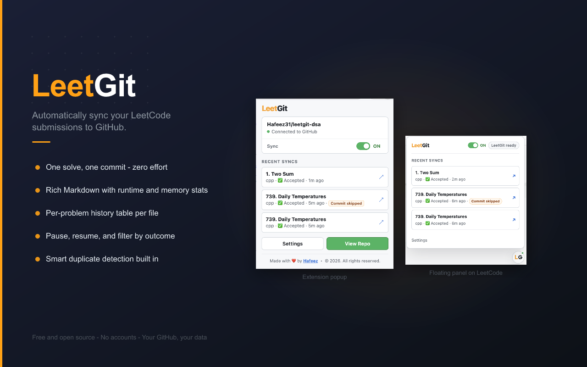
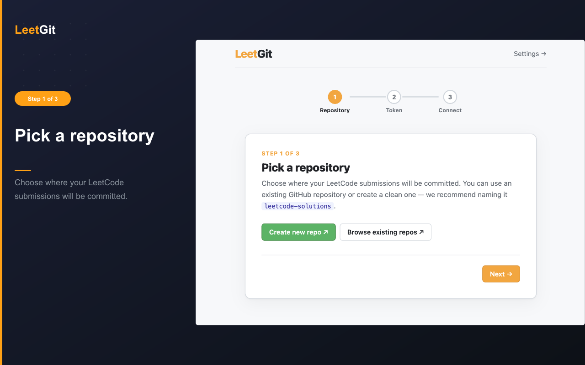
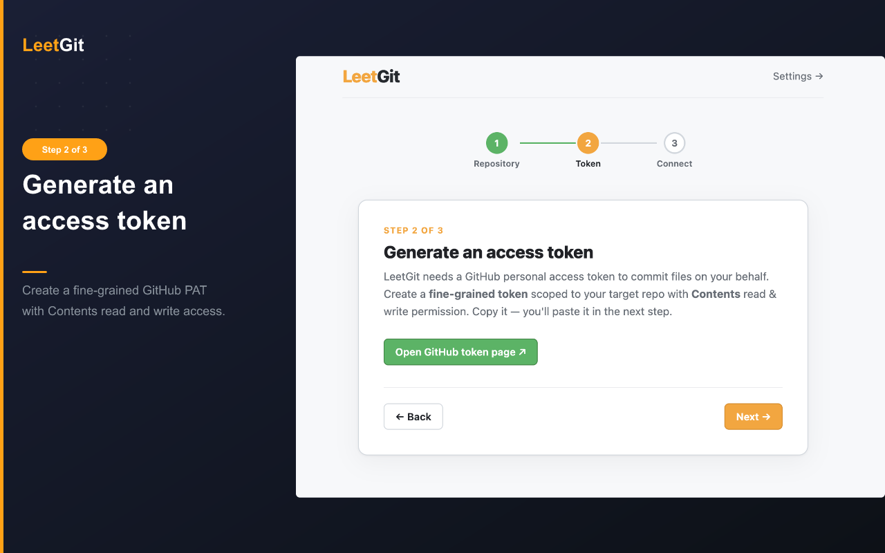
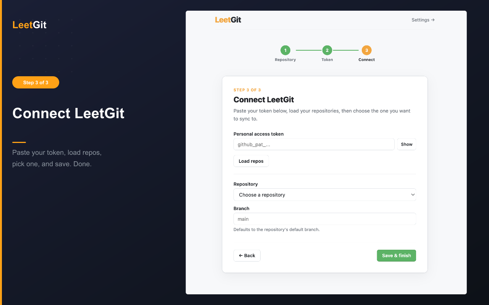
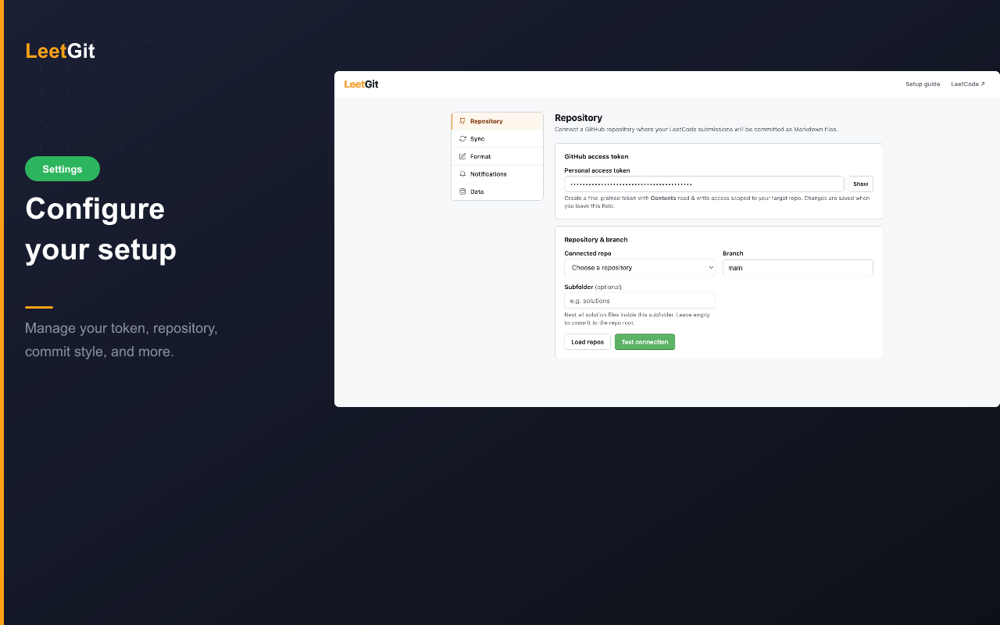
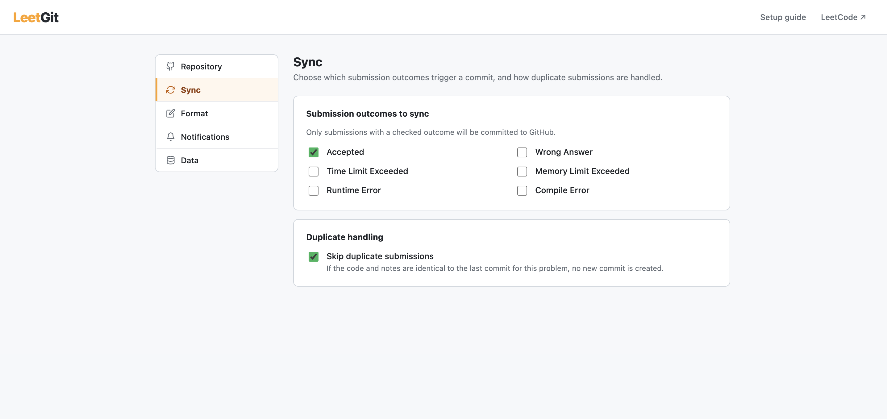
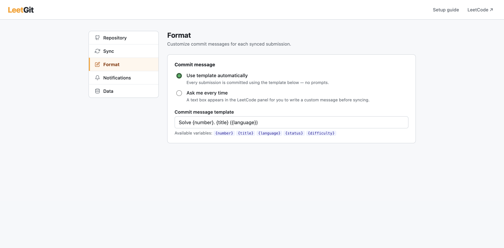
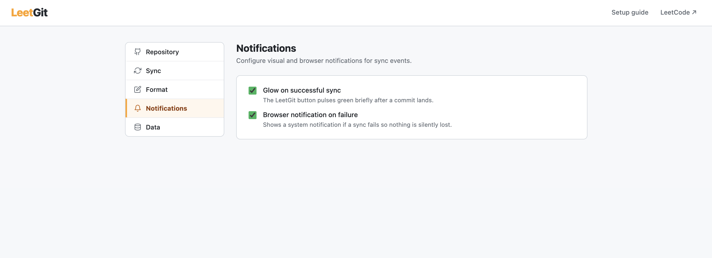
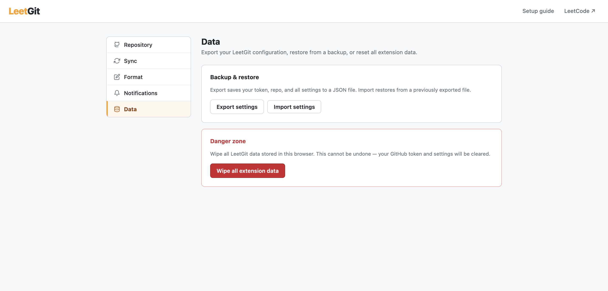

<div align="center">
  
  <h1>LeetGit</h1>
  <p><strong>Automatically sync your LeetCode submissions to GitHub — one solve, one commit.</strong></p>

  
  
  
</div>

---

## About

LeetGit is a Chrome extension that captures your LeetCode submissions the moment you hit **Submit** and commits them to a GitHub repository as structured Markdown files — complete with problem title, difficulty, topics, runtime percentile, memory percentile, your personal notes, and a per-problem history table.

No copy-paste, no manual uploads. Solve a problem, get a commit. Your entire LeetCode journey becomes a permanent, browsable archive on GitHub.

---

## Features

- **Automatic capture** — Intercepts submissions silently; works with Accepted, Wrong Answer, TLE, and more
- **Rich Markdown commits** — Each solution file includes runtime & memory percentiles, difficulty, topic tags, and your LeetCode notes
- **Per-problem history table** — Tracks every attempt per problem (language, status, runtime, memory, link)
- **Pause / resume** — Toggle syncing on or off from the popup or the floating panel; missed submissions are silently discarded
- **Duplicate detection** — Skips a commit when code and notes haven't changed since the last sync
- **Flexible commit messages** — Use a template with `{number}`, `{title}`, `{language}`, `{status}`, `{difficulty}`, or write a custom message per submission
- **Sync filtering** — Choose which outcomes trigger commits (Accepted only, or include WA / TLE / etc.)
- **Subfolder support** — Nest all solutions under a custom path inside your repo (e.g. `solutions/`)
- **Settings backup** — Export, import, or wipe your configuration at any time
- **Token expiry warning** — The popup surfaces a warning before your GitHub token expires

---

## Screenshots

### Popup & floating panel

<p align="center">
  
</p>

---

### Setup guide

<p align="center">
  
  <br/><em>Step 1 — Pick a repository</em>
</p>

<p align="center">
  
  <br/><em>Step 2 — Generate a GitHub access token</em>
</p>

<p align="center">
  
  <br/><em>Step 3 — Connect LeetGit</em>
</p>

---

### Settings

<p align="center">
  
  <br/><em>Repository — GitHub token, repo, branch, and subfolder</em>
</p>

<p align="center">
  
  <br/><em>Sync — Choose which outcomes trigger a commit and how duplicates are handled</em>
</p>

<p align="center">
  
  <br/><em>Format — Commit message template or per-submission prompts</em>
</p>

<p align="center">
  
  <br/><em>Notifications — Glow on success, browser notification on failure</em>
</p>

<p align="center">
  
  <br/><em>Data — Export, import, or wipe all extension data</em>
</p>

---

## Installation

### Requirements

- Google Chrome (or any Chromium-based browser)
- A GitHub account and a repository to sync solutions to

### Load the extension (unpacked)

```bash
# 1. Clone the repository
git clone https://github.com/Haffee31/leetgit.git
cd leetgit

# 2. Install dev dependencies (used for icon generation only — no runtime deps)
npm install
```

3. Open `chrome://extensions` in Chrome
4. Enable **Developer mode** (toggle in the top-right corner)
5. Click **Load unpacked** and select the project folder
6. The **LeetGit** icon appears in your Chrome toolbar

> Chrome Web Store listing coming soon.

---

## Setup

LeetGit walks you through setup in three steps when first installed. You can also open **Settings** from the popup at any time.

**Step 1 — Pick a repository**

Use an existing GitHub repo or create a new one. We recommend naming it `leetcode-solutions` to keep things clean.

**Step 2 — Generate a token**

Create a **fine-grained GitHub Personal Access Token** scoped to your target repository with **Contents: read & write** permission.

→ [Open GitHub token page](https://github.com/settings/personal-access-tokens/new)

**Step 3 — Connect**

Click the LeetGit icon in the toolbar → paste your token → **Load repos** → choose the repo and branch → **Save & finish**.

That's it. Solve a problem on LeetCode and watch the commit land in your repo.

---

## Usage

| Action | How |
|---|---|
| Sync a submission | Just submit on LeetCode — LeetGit handles the rest |
| Open / close the panel | Press **Alt+Shift+L** on any LeetCode problem page |
| Check recent syncs | Click the toolbar icon; last 3 syncs are shown with GitHub links |
| Pause / resume | Toggle the ON/OFF switch in the popup or the floating panel |
| Retry a failed sync | Click **Retry last failed sync** in the floating panel |
| Custom commit message | Enable "Ask me every time" in Settings → a text box appears after each submission |
| Open Settings | Click **Settings** in the popup or the floating panel |

---

## Settings Reference

| Setting | Default | Description |
|---|---|---|
| GitHub token | — | Fine-grained PAT with Contents read/write on the target repo |
| Repository | — | GitHub repo where solutions are committed |
| Branch | `main` | Branch to commit to |
| Subfolder | *(empty)* | Optional path prefix (e.g. `solutions`) |
| Sync outcomes | Accepted | Which submission statuses trigger a commit |
| Skip duplicates | On | Skips a commit when code and notes are unchanged from the last sync |
| Commit message mode | Template | Use the template automatically, or be prompted each time |
| Commit message template | `Solve {number}. {title} ({language})` | Variables: `{number}` `{title}` `{language}` `{status}` `{difficulty}` |
| Glow on success | On | The floating button pulses green after a successful commit |
| Notify on failure | On | Shows a browser notification if a sync fails |

---

## How It Works

LeetGit uses three layers, each isolated as required by Chrome MV3:

- **`injected.js`** runs in the page's MAIN world and wraps `fetch` / `XMLHttpRequest` to capture submission payloads and results without interfering with LeetCode's own network calls.
- **`content.js`** runs in an isolated world, renders the floating panel and popup bridge, and relays captured submissions to the background service worker.
- **`background.js`** (MV3 service worker) fetches LeetCode problem metadata, builds the Markdown, and commits to GitHub using the Git Data API (`blob → tree → commit → ref PATCH`) with a local HEAD cache to avoid stale-ref 422 errors on consecutive syncs.

---

## Development

```bash
# Clone and install
git clone https://github.com/Haffee31/leetgit.git
cd leetgit
npm install

# Run the test suite
npm test

# Regenerate extension icons after editing icons/icon.svg
npm run generate-icons
```

### Project Structure

```
leetgit/
├── src/
│   ├── background.js      # Service worker — GitHub sync, settings, HEAD cache
│   ├── content.js         # Floating panel, popup bridge, state display
│   ├── injected.js        # fetch/XHR interceptor (MAIN world)
│   ├── options.js         # Settings page logic, auto-save
│   ├── onboarding.js      # Setup wizard (3-step inline form)
│   ├── shared.js          # Markdown rendering, path helpers (unit-tested)
│   ├── settings.js        # chrome.storage helpers and defaults
│   ├── settings-page.css  # Shared design system for settings + onboarding
│   └── popup.css          # Popup-specific styles
├── icons/                 # PNG icons at 16/32/48/128px
├── scripts/
│   └── generate-icons.mjs # SVG → PNG via @resvg/resvg-js
├── test/                  # Node.js built-in test runner
├── manifest.json
├── popup.html
├── options.html
└── onboarding.html
```

---

## Contributing

Contributions are welcome! Here's how to get started:

1. **Fork** the repository and create a branch from `main`
2. **Make your changes** with focused, single-purpose commits
3. **Run `npm test`** — all tests must pass before submitting
4. **Open a pull request** with a clear title and description of what you changed and why

Please **open an issue first** before starting large features or refactors so we can align on the approach.

---

## Author

**Hafeez Mohamad**

| | |
|---|---|
| 💼 LinkedIn | [linkedin.com/in/hafeez-mohamad](https://www.linkedin.com/in/hafeez-mohamad/) |
| 🐙 GitHub | [github.com/Haffee31](https://github.com/Haffee31/) |
| 🐦 X / Twitter | [x.com/Hafeez_31](https://x.com/Hafeez_31) |
| 🌐 Website | [haffee.vercel.app](https://haffee.vercel.app/) |
| 📧 Email | haffeecareer@gmail.com |

---

## License

This project is licensed under the **MIT License** — see the [LICENSE](LICENSE) file for details.
